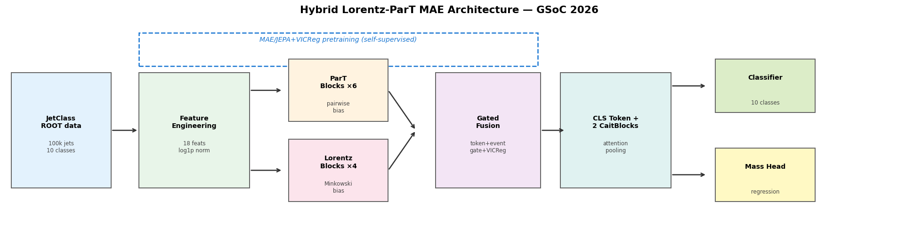
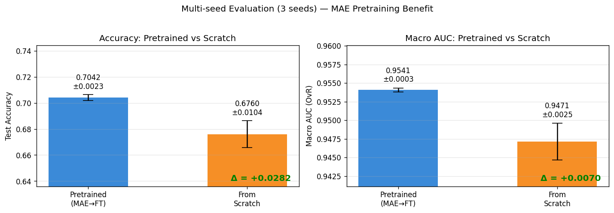

# Hybrid Lorentz-ParT MAE for JetClass Event Classification

## Overview
This repository presents a notebook-driven GSoC 2026 research pipeline for **10-class jet event classification** on JetClass.
The final system combines a **ParT + Lorentz hybrid architecture** with **MAE pretraining** before supervised fine-tuning.
The focus is not only strong final scores, but also **reliability, reproducibility, and clear ablation evidence**.
Final reporting is based on the consolidated benchmark notebook: `6-Hybrid_LorentzParT_MAE_GSoC2026_FINAL -.ipynb`.

## Key Contributions
- Built a **hybrid ParT + Lorentz** model for complementary particle-interaction and physics-aware representation learning.
- Used **two-stage training**: MAE pretraining first, then supervised fine-tuning.
- Added **attention-gated fusion** to combine branch signals adaptively.
- Used **stability-focused training utilities** (checkpointing, early stopping, numerical safety, compile fallback).
- Reported **multi-seed performance behavior** and MAE impact instead of relying on a single run.

## Methodology
The final pipeline follows a clean sequence:
1. Load and prepare JetClass events (100k sampled events, 80/10/10 split).
2. Build per-particle and pairwise physics-inspired features.
3. Pretrain with masked autoencoding on particle-level inputs.
4. Fine-tune on supervised jet labels.
5. Evaluate with macro AUC and accuracy, then validate improvements with ablation and multi-seed analysis.

Core method blocks in the final notebook:
- **Hybrid architecture**: ParT branch + Lorentz-aware branch
- **Training flow**: MAE pretraining → fine-tuning
- **Fusion**: attention-gated branch fusion before classification

## Architecture Overview
The model processes particle-level features, learns complementary representations in ParT and Lorentz branches, and fuses them with learned gates for final class prediction.



## Training Strategy
The final notebook uses a **two-stage strategy**:
- **Stage 1 (Self-supervised)**: MAE pretraining
- **Stage 2 (Supervised)**: Fine-tuning for 10-class jet classification

Selection logic used in fine-tuning:
- Primary checkpoint metric: **validation macro AUC (OvR)**
- Fallback: if validation AUC is `NaN`, use **validation accuracy** for robust model selection

Primary tracked metrics:
- Accuracy
- Macro AUC (OvR)
- Macro AUC (OvO)

## Results (Final Notebook)
From `notebook/6-Hybrid_LorentzParT_MAE_GSoC2026_FINAL -.ipynb`:

- **Overall Test Accuracy: 0.7020**
- **Macro AUC (OvR): 0.9536**
- **Macro AUC (OvO): 0.9536**


## Ablation & Insights (Final Notebook)
Final ablation outputs report:

- `with_mae_pretrain`: `val_acc = 0.5961`, `val_auc = 0.919528`
- `no_mae_pretrain`: `val_acc = 0.5726`, `val_auc = 0.911468`

Key takeaway:
- MAE pretraining provides a clear validation lift in both accuracy and macro AUC in the controlled pretrain-vs-scratch comparison.


## Stability & Reliability
The final notebook includes a dedicated multi-seed comparison summary for pretrained vs scratch modes.
Reported MAE benefit summary:

- Accuracy gain: **+0.0282** (**+4.2% relative**)
- AUC gain: **+0.0070**
- Variance trend: **4.5× lower accuracy variance** with pretraining (reported summary)

Mean ± std bars are used in the comparison plot to communicate both performance level and variability across seeds.



## 🧠 Notebook Journey

### Notebook Progression Table
| Notebook | What was added | What problem it solved | Improvement it brought |
|---|---|---|---|
| `1-Hybrid_Lorentz_ParT_MAE_JetClass_GSoC2026.ipynb` | Initial end-to-end hybrid MAE workflow scaffold | Established a complete baseline pipeline | Enabled iterative experimentation on one consistent setup |
| `2-Hybrid_Lorentz_ParT_MAE_JetClass_GSoC2026 .ipynb` | Next pipeline refinement pass | Reduced workflow friction during repeated runs | Improved experimentation consistency |
| `3-Hybrid_Lorentz_ParT_MAE_JetClass_GSoC2026.ipynb` | Intermediate architecture/training refinements | Addressed early-stage modeling/training gaps | Prepared a stronger base for later consolidation |
| `4-Hybrid_Lorentz_ParT_MAE_JetClass_GSoC2026.ipynb` | Reliability-oriented updates before finalization | Improved confidence in comparative evaluation | Better stability analysis readiness |
| `5-Hybrid_Lorentz_ParT_MAE_JetClass_GSoC2026.ipynb` | Pre-final integration pass | Unified successful experimental elements | Reduced transition risk to final benchmark notebook |
| `6-Hybrid_LorentzParT_MAE_GSoC2026_FINAL -.ipynb` | Final consolidated benchmark pipeline | Single source of truth for final reporting | Best reported final performance and complete evidence package |

### 🔄 Iterative Improvements
Across the notebook sequence, the project evolved through repeated refinement of:
- data and feature handling,
- hybrid model/training flow,
- evaluation discipline (ablation + multi-seed reporting).

This progression reflects:
- **Research thinking**: compare alternatives instead of assuming gains,
- **Engineering maturity**: improve reliability and training control,
- **Iterative improvement**: converge toward a stable, reproducible final benchmark.


## Repository Structure
```text
gsoc-p-2-readme/
├── notebook/
│   ├── 1-Hybrid_Lorentz_ParT_MAE_JetClass_GSoC2026.ipynb
│   ├── 2-Hybrid_Lorentz_ParT_MAE_JetClass_GSoC2026 .ipynb
│   ├── 3-Hybrid_Lorentz_ParT_MAE_JetClass_GSoC2026.ipynb
│   ├── 4-Hybrid_Lorentz_ParT_MAE_JetClass_GSoC2026.ipynb
│   ├── 5-Hybrid_Lorentz_ParT_MAE_JetClass_GSoC2026.ipynb
│   └── 6-Hybrid_LorentzParT_MAE_GSoC2026_FINAL -.ipynb
├── images/
├── Research paper/
├── README_senior.md
└── README.md
```

## How to Run
1. Ensure JetClass data is accessible at the path used in the final notebook config (`../datasets/JetClass` by default).
2. Open `notebook/6-Hybrid_LorentzParT_MAE_GSoC2026_FINAL -.ipynb`.
3. Run notebook sections in order:
   - Setup and data loading
   - Feature engineering
   - MAE pretraining
   - Fine-tuning
   - Evaluation, ablation, and multi-seed analysis
4. Generated result plots are saved in the working directory (for example: `per_class_metrics.png`, `multiseed_comparison.png`).
5. Note: some notebook filenames in this repository intentionally include spaces/suffix characters; use exact names as listed above when opening files.

## Future Work
- Extend full multi-seed reporting with per-seed logs in the final notebook outputs.
- Expand controlled ablations for fusion/gating choices under longer schedules.
- Explore stronger checkpoint averaging or ensembling on top of the current best run.
- Deepen joint classification + mass-regression analysis under the same training protocol.
- Add exportable experiment summaries for easier benchmark comparison across notebook versions.

## References
- Qu et al. (2022). *Particle Transformer for Jet Tagging.* [arXiv:2202.03772](https://arxiv.org/abs/2202.03772)
- Spinner et al. (2024). *Lorentz-Equivariant Geometric Algebra Transformers for High-Energy Physics.* [arXiv:2405.14806](https://arxiv.org/abs/2405.14806)
- He et al. (2022). *Masked Autoencoders Are Scalable Vision Learners.* [arXiv:2111.06377](https://arxiv.org/abs/2111.06377)
- Bardes et al. (2022). *VICReg: Variance-Invariance-Covariance Regularization.* [arXiv:2105.04906](https://arxiv.org/abs/2105.04906)
- Touvron et al. (2021). *Going deeper with Image Transformers (CaiT).* [arXiv:2103.17239](https://arxiv.org/abs/2103.17239)
- Nguyen (2025). *GSoC 2025 — Event Classification with Masked Transformer Autoencoders.* [Medium](https://medium.com/@thanhnguyen14401/gsoc-2025-with-ml4sci-event-classification-with-masked-transformer-autoencoders-6da369d42140)
- JetClass dataset (as used by the final notebook via ROOT files): [JetClass](https://zenodo.org/records/6619768)
